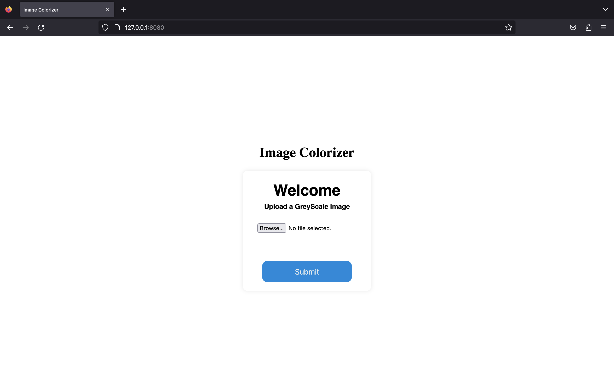
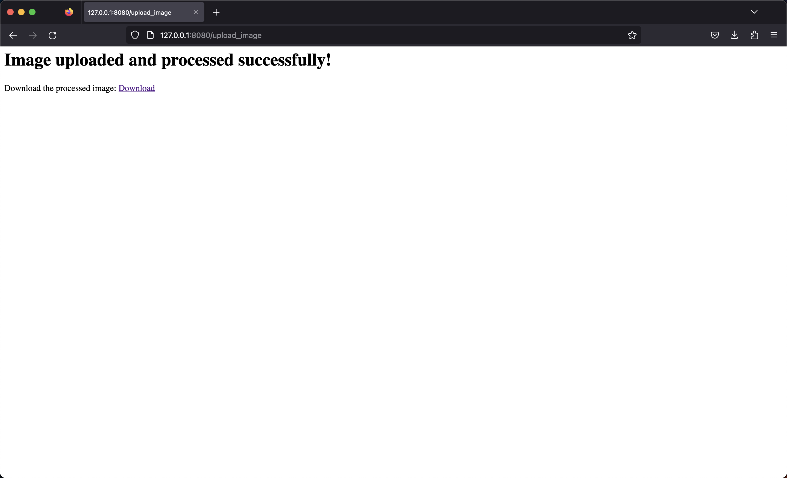

# image-colorization-api

## Description

The Image Colorization API is a RESTful API that allows users to colorize black and white images using a pre-trained machine learning model. With this API, you can easily integrate image colorization capabilities into your own applications, websites, or services.

## Overview

The Image Colorization API provides a simple and efficient way to add colorization functionality to your projects. It utilizes a state-of-the-art machine learning model that has been trained on a large dataset of colored images. The model takes a black and white image as input and produces a colorized version of the image as output.

## Installation

- Clone the repository:

```bash
git clone https://github.com/yasharora102/image-colorization-api.git
```

- Install the dependencies:

```bash
pip install -r requirements.txt
```

- Get the models from Google Drive: [Link](https://drive.google.com/file/d/1hBOhmUpEOexM3t_XH4EyiKemKkNore6r/view?usp=sharing)

- Extract the models and place them in the `models` directory.

- Run the server:

```bash
uvicorn app:app --reload --port 8080
```

- Go to `http://127.0.0.1/docs` to view the Swagger UI.

- Go to `http://127.0.0.1/` to view the application.

## Usage

### Sample Request

```python
import requests
import os

url = "http://127.0.0.1:8080/upload" 

file_path = "images.jpeg"  # Replace with the path to your image file

with open(file_path, "rb") as file:
    files = {"file": file}
    response = requests.post(url, files=files)

if response.status_code == 200:
    with open("output.jpg", "wb") as file:
        file.write(response.content)
    print("Image saved successfully")
else:
    print("Error:", response.text)
```

## Running the Web App

- Run the server:

```bash
uvicorn app:app --reload --port 8080
```

- Go to `http://127.0.0.1:8080/` to view the application.

<!-- Put Image -->
##### Web App


##### Download Page


View the tutorial on [YouTube](https://youtu.be/jv8AyJlVT3g).

## Sample Images
<table>
    <tr>
        <td>
            <div class=text>
                Original Image
            </div>
        </td>
        <td>
            <div class=text>
                    Colorized Image
            </div>
        </td>
    </tr>

  <tr>
    <td>
        
    </td>
    <td>
    
    </td>
  </tr>
  <tr>
    <td>
      
    </td>
    <td>
      
    </td>
  </tr>
</table>


## Development

- For creating new features, create new branch locally and work on it.
- After testing the feature, create a PR.
- To fetch new changes

```bash
    $ git fetch upstream
    $ git rebase upstream/main
```

## Formatting

- Use `black` for formatting the code.
- `black` is already installed in the project dependencies.
- To format the code, run `black .` in the project root directory.
